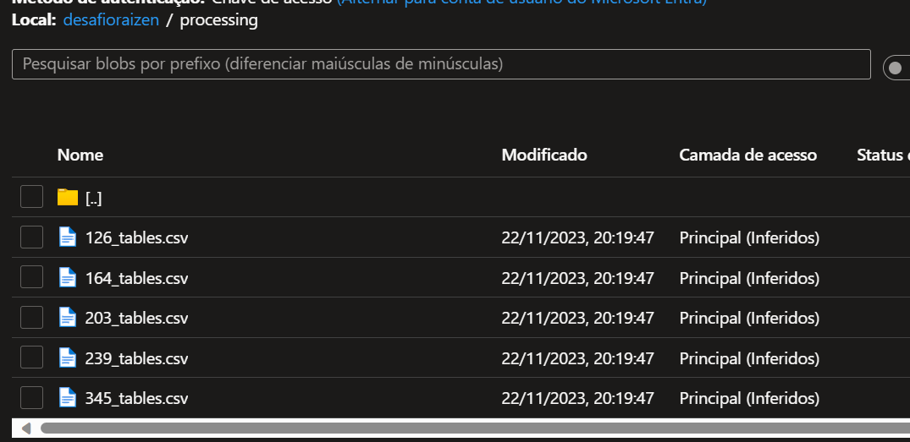
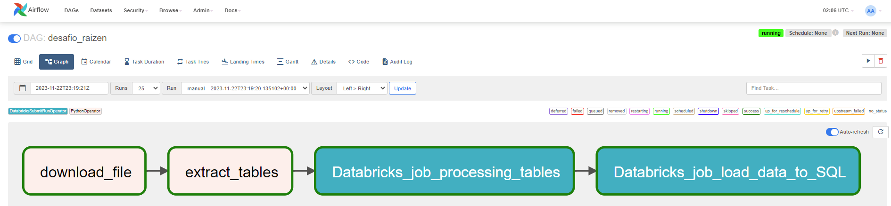

# Desafio Raizen

Este projeto tem como objetivo princiapal criar um pipeline de processamento de dados para extrair informações fornecidas do arquivo "vendas-combustiveis-m3.xls". E com objetivo secundario, demonstrar uma variedade de ferramentas e skill na area de engenharia de dados

## Arquitetura dos componentes

* Airflow para orquestração de todo pipeline de dados
* Azure Databricks para executar os notebooks com codigos pyspark
* Azure DataLake para armazenar todas as camadas de arquivos processados
* Azure SQL Server para armazenar os dados finais da extração
* Docker para conteinerização do projeto

## Execução do projeto

### Clonar o projeto

    $ git clone https://github.com/lucasvaladares13/DesafioRaizen2022.git

### Criar a imagem do airflow Docker

Navegar para /docker:

Executar o comando

    $ docker build --rm --force-rm -t docker-airflow:2.3.3 .

### Iniciar os containers airflow

Navegar para /docker:

Executar o comando

    $ docker-compose -f docker-compose.yaml up -d

### Portal Azure

Criar o recurso do Databricks

Criar a conta de armazenamento blob storage e gerar chave token SAS

Criar o recurso SQL server

### DataLake - Blob Storage

Criar a pasta cliente e carregar o arquivo "vendas-combustiveis-m3.xls"

Criar as pastas staging, processing, compiled

### Portal Databricks

Criar cluster e armazenar valor do ID

Criar workspace e carregar os notebooks

### Airflow

Criar conexão com Azure_Blob_Storage

Criar conexão com Azure_Databricks

Executar DAG desafio_raizen

### SQL Server

Dados para conexão e consulta no banco de dados:

login: raizen_query

password: desafio@2023

Resultado consulta:

